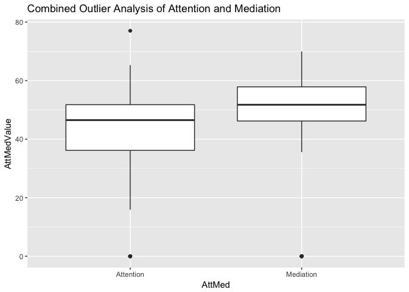
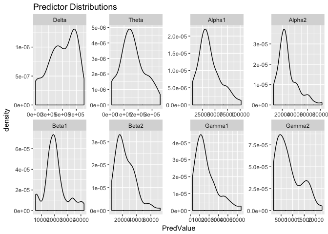
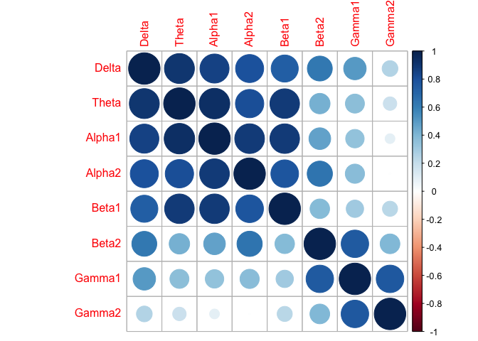

Exercise Set 2 Solution
================
Tjeerd Dijkstra
2018-01-08

Introduction
============

Examplary solution of excersises set 2 for Tuebingen neuroschool Machine Learning 1 Class. Analysis of data from the "EEG brainwave for confusion" Kaggle competition at <https://www.kaggle.com/wanghaohan/eeg-brain-wave-for-confusion> This solution shows a two of features that are helpful in writing reproducible code:

1.  it uses an R notebook, webinar at <https://www.rstudio.com/resources/webinars/introducing-notebooks-with-r-markdown/>
2.  it uses git and github for version control and backup. See <http://happygitwithr.com>

``` r
library(readr); library(dplyr, warn.conflicts = FALSE); library(tidyr); library(tibble); library(ggplot2)
```

1 Load and clean data
=====================

E1.1&E1.2
---------

I prefer to use `read_csv()` from the readr package as it gives more control than the default R `read.csv()`. I also like to set the colum types myself as this faster and safer. Lastly, as a minor detail it is a good idea to name code chunks after the action in the chunk, here reading data.frame (tibble) Y as `readY`. Note that you can only see the code chunck names in the Rmd source code (in RStudio) not in the rendered markdown in Github.

``` r
Y <- read_csv("EEGData.csv", col_types = "ddddddddddddddd",
              col_names = c("SubjectID", "VideoID", "Attention", "Mediation",
                            "Raw", "Delta", "Theta", "Alpha1", "Alpha2", "Beta1", "Beta2",
                            "Gamma1", "Gamma2", "ExpectedConfusion", "ReportedConfusion"))
```

E1.4
----

For some reason the ID variables are coded as floating point in the original data file. Change the ID variables to integer. I use package dplyr with the pipe notation. Using dplyr for data wrangling avoids (almost) all loops.

``` r
Y <- Y %>% mutate(SubjectID = as.integer(SubjectID), VideoID = as.integer(VideoID))
```

E1.3
----

calculate mean of predictors per subject and video and store result in data.frame `Ymean`.

``` r
Ymean <- Y %>% group_by(SubjectID, VideoID) %>% summarise_all(mean)
```

optional
--------

This adds reported confusion as meaningfully encoded factor with levels "confused" and "not confused". In general you should encode your factors with descriptive levels. Almost all packages in R can work with these (in particular caret and ggplot2) but there are "old school" exceptions (for example glmnet for L1-penalized generalized linear models). As a last note, you should also explicitly prescribe the order of the levels. With two levels this is rarely relevant but when you have more there is usually a base or reference level that should come first.

``` r
Ymean <- Ymean %>% mutate(RepConfFactor = factor(if_else(ReportedConfusion == 1, "confused", "not confused"),
                                         c("confused", "not confused")))
```

2 Outlier analysis
==================

Using `ggpairs()` to look at all the data. Note the lines of dots for Attention, Mediation and Raw (Raw is irrelevant since we will not be using it). As a minor point, by default `ggpairs()` spits out a progress bar for every panel (all 11<sup>2</sup> = 121 of them). This output messes up the notebook with useless information. The `progress = FALSE` discards the progress bar.

``` r
library(GGally, warn.conflicts=FALSE); print(ggpairs(select(ungroup(Ymean), Attention:Gamma2)), progress = FALSE)
```


Using `ggplot` to look at Attention and Mediation data separately. This shows that subject 6 has 10 outliers with Attention = 0 and Mediation = 0. Another outlier occurs for subject 3.

``` r
print(ggplot(Ymean, aes(x = VideoID, y = Attention)) + geom_point() +
        facet_wrap( ~ SubjectID, nrow = 2) + labs(title = "Attention"))
```


``` r
print(ggplot(Ymean, aes(x = VideoID, y = Mediation)) + geom_point() +
        facet_wrap( ~ SubjectID, nrow = 2) + labs(title = "Mediation"))
```


E2&E3
-----

Visual way to show that (1) value 0 is an outlier using box plats and (2) Attention and Mediation have the same outliers by combining the two separate plots for Attention and Mediation. You might also argue that the value of Attention of ~78 is an outlier, I left it in but this is a matter of taste. `gather()` prepares a data.frame for plotting with ggplot such that `AttMed` can be used as a factor to group and label the data points.

``` r
Y.plot <- gather(Ymean, AttMed, AttMedValue, c(Attention, Mediation))
print(ggplot(Y.plot, aes(x = AttMed, y = AttMedValue)) + geom_boxplot() +
        labs(title = "Combined Outlier Analysis of Attention and Mediation"))
```



``` r
print(ggplot(Y.plot, aes(x = VideoID, y = AttMedValue, group = AttMed, color = AttMed)) +
        geom_point() + facet_wrap( ~ SubjectID, nrow = 2) +
        labs(title = "Combined Outlier Analysis of Attention and Mediation"))
```


This shows the occurances of the outliers in a table.

``` r
Y.table <- Ymean %>% filter(Attention == 0 | Mediation == 0)
knitr::kable(Y.table, align = "c")
```

| SubjectID | VideoID | Attention | Mediation |    Raw    |   Delta  |   Theta  |   Alpha1  |   Alpha2  |   Beta1  |   Beta2   |   Gamma1  |   Gamma2  | ExpectedConfusion | ReportedConfusion | RepConfFactor |
|:---------:|:-------:|:---------:|:---------:|:---------:|:--------:|:--------:|:---------:|:---------:|:--------:|:---------:|:---------:|:---------:|:-----------------:|:-----------------:|:-------------:|
|     3     |    3    |     0     |     0     |  44.15972 | 679609.4 | 132381.8 |  42858.18 |  23484.26 | 14489.06 |  51326.99 |  13870.30 |  1893.528 |         0         |         0         |  not confused |
|     6     |    0    |     0     |     0     | 367.64286 | 807545.8 | 401609.5 | 112919.50 | 141040.74 | 81007.96 | 112267.42 |  73135.29 | 79095.264 |         0         |         1         |    confused   |
|     6     |    1    |     0     |     0     | 245.11972 | 595207.8 | 231366.3 |  41717.63 |  46124.11 | 48270.04 | 275703.88 | 287988.80 | 76448.254 |         0         |         0         |  not confused |
|     6     |    2    |     0     |     0     | 263.95902 | 584569.7 | 225168.7 |  38174.02 |  39712.16 | 47837.54 | 276137.37 | 241545.21 | 82950.344 |         0         |         0         |  not confused |
|     6     |    3    |     0     |     0     | 355.33621 | 855490.3 | 342884.9 | 125175.67 | 131039.50 | 96779.90 | 130072.51 |  92971.06 | 88753.534 |         0         |         1         |    confused   |
|     6     |    4    |     0     |     0     | 199.18750 | 733256.7 | 255086.1 |  55608.26 |  51380.47 | 56770.83 | 297833.26 | 283081.88 | 97845.972 |         0         |         1         |    confused   |
|     6     |    5    |     0     |     0     | 395.21138 | 675630.0 | 171917.0 |  44623.52 |  67194.67 | 49157.89 | 104084.02 | 109254.37 | 52460.350 |         1         |         0         |  not confused |
|     6     |    6    |     0     |     0     | 418.47414 | 793951.1 | 247062.8 |  42978.52 |  75027.98 | 61951.91 | 159168.86 | 146848.16 | 66681.190 |         1         |         1         |    confused   |
|     6     |    7    |     0     |     0     | 575.55752 | 755965.5 | 172671.8 |  56392.85 |  66123.72 | 55284.52 |  59506.11 |  53265.51 | 49019.354 |         1         |         0         |  not confused |
|     6     |    8    |     0     |     0     | 426.96721 | 879076.2 | 241419.5 |  83642.09 |  93757.44 | 64246.57 |  83454.62 |  55968.06 | 56787.361 |         1         |         1         |    confused   |
|     6     |    9    |     0     |     0     | 300.86861 | 822708.7 | 208945.3 |  67313.58 |  77372.23 | 51915.08 |  72598.35 |  61240.48 | 49866.518 |         1         |         0         |  not confused |

E4
--

``` r
Ymean <- Ymean %>% filter(Attention > 0 & Mediation > 0)
```

3 Predictor distributions and correlations
==========================================

E5
--

``` r
Y.plot <- gather(Ymean, Predictor, PredValue, Delta:Gamma2)
print(ggplot(Y.plot, aes(x = PredValue)) +
        geom_density() + facet_wrap( ~ Predictor, nrow = 2, scales = "free") +
        labs(title = "Predictor Distributions"))
```



``` r
library(e1071)
PredSkew <- Y.plot %>% group_by(Predictor) %>% summarize(Skewness = skewness(PredValue))
knitr::kable(PredSkew, align = "c")
```

| Predictor |  Skewness  |
|:---------:|:----------:|
|   Alpha1  |  0.7937144 |
|   Alpha2  |  1.1751507 |
|   Beta1   |  0.6952884 |
|   Beta2   |  1.0630570 |
|   Delta   | -0.4232785 |
|   Gamma1  |  1.2104615 |
|   Gamma2  |  0.8156700 |
|   Theta   |  0.3088136 |

E6
==

Left for next year (2019!)

E7
==

`corrplot()` shows that Delta, Theta, Alpha1, Alpha2 and Beta2 are more correlated as a group and that Beta2, Gamma1 and Gamma2 form a second group.

``` r
library(corrplot, quietly = TRUE); corrplot(cor(select(ungroup(Ymean), Delta:Gamma2)))
```

    ## corrplot 0.84 loaded


